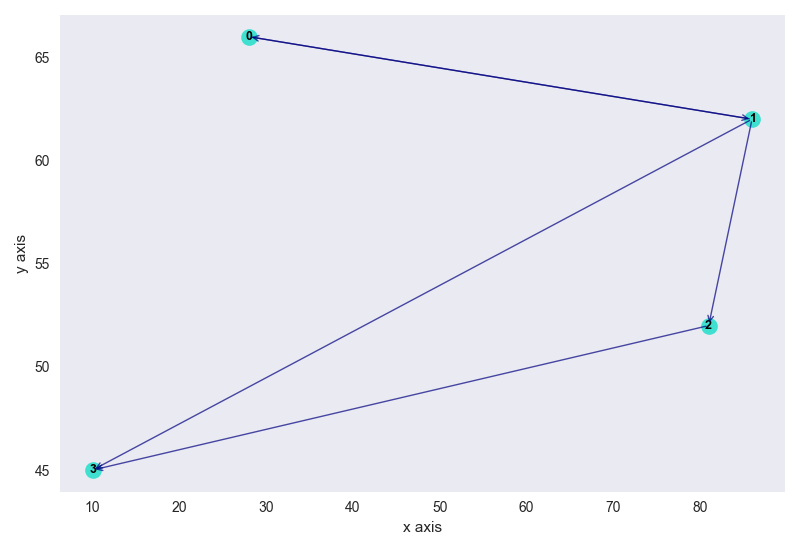

# oop-ex3

## Running the Code

If you are using an IDE- make sure the `src` directory is marked as the `Sources Root`.

```
pip install -r requirements.txt
```

```
python main.py
```

## Contributors

Eitan Kats, Adi Yafe, Ori Howard

## Pictures of the Graphs

### check1-graph



### check2-graph


## Idea of Implementation

We wanted to create a graph that meets all the requirements of the functions in the classes, and run algorithms
efficiently on it.

How we chose to represent the graph:

1. nodeMap - this is a hashmap which contains all the nodes of the graph, the key is the id of the node and the value is
   the node itself
2. parsedEdges - this is a list of the edges that are in the graph
3. MCount - this is the variable used to track the changes made to the graph

Each node comprises the following:

1. pos - location of the graph node
2. id - the id of the node
3. weight - the weight of the node
4. destMap - a hashmap that maps between the nodes that this node can reach and the edges that reach them
5. sourceMap - a hashmap that maps between a node and the sources that can each is
6. tag - This contains a tag from the Enum mainly used for coloring in the algorithms

Each edge comprises the following:

1. source - the id of the source node
2. dest - the id of the dest node
3. weight - the weight of the edge

The following algorithms were the core of the project:

* Dijkstra - We have implemented the Dijkstra algorithm with the minimum heap source of the Dijkstra
  algorithm: https://en.wikipedia.org/wiki/Dijkstra%27s_algorithm
* DFS - When we check whether the graph is connected we use two iterations of DFS, the first one on the original graph
  which inverses the graph and a 2nd one on the inverse graph
* plot_graph - we used the `matplotlib` library to display the graph

## Class overview

### DiGraph

This is an implementation of the `GraphInterface`. The details about the design of this class are in
the [idea of Implementation section](##ideaOfImplementation).

### GraphAlgo

This class implements the `GraphAlgoInterface` interface. It contains the implementation of Dijkstra, dfs, tsp,
plot_graph as described above.

### GraphEdge

An object representing an edge in the graph.

### GraphNode

An object representing a node in the graph.

### Position

An object representing the location of the node, this is used in the GUI to draw the nodes.

### NodeTagEnum

This Enum is used when traversing through the graph (DFS) to tag the nodes that are visited.

## Detailed Execution Details of the Algorithms


### Times in Java:

| Graph Size | isConnected | Center  |   TSP   | load     | save    |      shortestPath           |
|------------|-------------|---------|---------|----------|---------|-----------------------------|
| 1000       |   380msec   | 1.6 sec |   3sec  |201ms     |376ms    |239msec (100 to 312)         |
| 10k        |   1.9sec    | 4.1 Min |   20sec |558ms     | 200ms   |726msec (819 to 4012)        |
| 100k       |   17sec     |too long |1m,15sec |5.6sec    |9.2sec   |7.125sec(12933 to 44311)     |
| 1M         |   51sec     |too long |too long |15.7sec   |34.1sec  |24.5sec(312343 to 521256)    |
| G1 (16)    |   79msec    |  81msec |   67ms  | 17ms     | 90ms    |74msec (1 to 8)              |
| G2 (31)    |   84msec    |  90msec |   93ms  | 17ms     | 92ms    |91msec (5 to 13)             |
| G3 (48)    |   93msec    | 101msec |   92ms  | 37ms     | 78ms    |91msec (26 to 46)            |

### Times in Python:

| Graph Size | isConnected | Center  |   TSP   | load   | save |             shortestPath        |
|------------|-------------|---------|---------|------  |------|---------------------------------|
| 1000       |   220msec   | 29 sec  | 400ms   |43ms    |150ms |84msec (100 to 312)              |
| 10k        |   2.3sec    |too long | 22sec   |542ms   |1.5sec|134msec (819 to 4012)            |
| 100k       |  82.388sec  |too long | 2 min   |12.7sec |32.5s |32.9sec (12933 to 44311          |
| 1M         | 3min,50sec  |too long |too long |35.7ec  |1m.30s| 2min (312343 to 521256)                                |
| G1 (16)    |   4msec     |  11msec |   4ms   |   3ms  |  4ms |1msec (1 to 8)                   |
| G2 (31)    |   4msec     |  9msec  |   7ms   |   5ms  |  2ms |2msec (5 to 13)                  |
| G3 (48)    |   5msec     | 27msec  |   12ms  |   6ms  |  3ms |3msec (26 to 46)                 |

